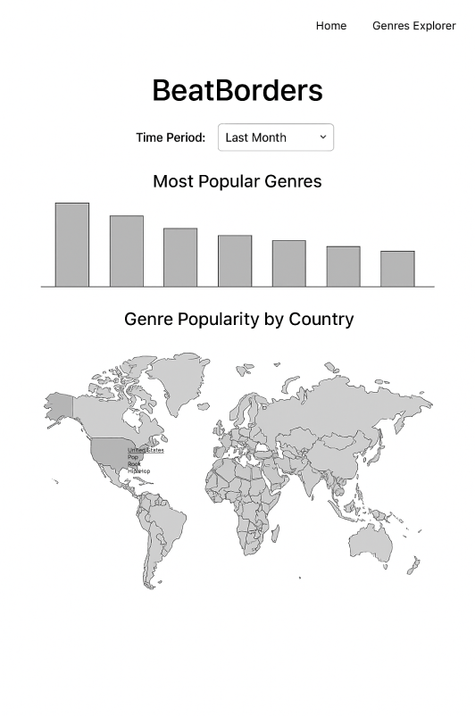
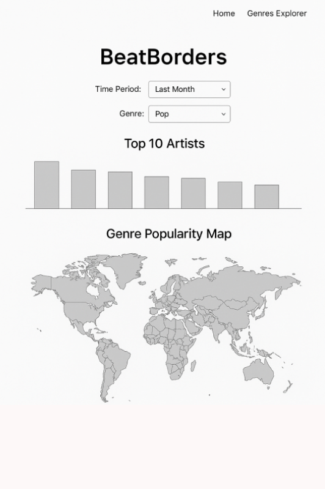
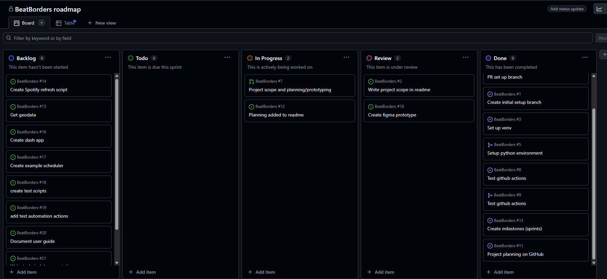

# BeatBorders

[GitHub Repository](https://github.com/jw220163a/BeatBorders)

*BeatBorders: Mapping music genre popularity across country borders.*

---

## Table of Contents

1. [Introduction](#introduction)
2. [Proposed Product](#proposed-product)
3. [Design & Prototype](#design--prototype)
4. [Project Planning](#project-planning)
5. [MVP Development](#mvp-development)
6. [Test-Driven Development & CI/CD](#test-driven-development--cicd)
7. [Technical Documentation](#technical-documentation)
8. [User Documentation](#user-documentation)
9. [Dash Application Implementation](#dash-application-implementation)
10. [Requirements Capture](#requirements-capture)
11. [Evaluation](#evaluation)

---

## Introduction

### Background & Problem Statement

With over 400 million active users, Spotify’s streaming data offers deep insights into listening habits. However, understanding how music genre preferences vary by geography is non-trivial: licensing agreements, cultural influences, and marketing efforts differ by country, making manual comparisons both time-consuming and error-prone.

### Project Overview

**BeatBorders** provides a unified interface to explore genre popularity worldwide. It retrieves streaming metrics for selected genres across Spotify’s markets, processes the data, and visualises insights through interactive maps and charts in a Plotly Dash application.

### Objectives

- **Automate Data Collection:** Fetch genre-related track data and market availability via Spotify’s Web API.
- **Aggregate & Analyse:** Compute relative genre popularity per country using streaming counts or proxy metrics (e.g., playlist appearances).
- **Visualise Insights:** Present choropleth maps, bar charts, and time-series plots for global overviews and country-level deep dives.

### Scope & Deliverables

- **Single-Page Dash App:** Dropdown selectors, map visualisations, and filter controls in one interface.
- **Backend Integration:** Local Python refresh script for Spotify OAuth token retrieval and data updates (server deployment as a future improvement).
- **CI/CD Pipeline:** GitHub Actions to run tests (pytest), lint (flake8), and run local builds on push to `main`.

### Audience & Use Cases

- **Music Industry Analysts:** Compare genre trends across regions for market research.
- **Data Enthusiasts & Developers:** Learn integration of Python, Dash, and external APIs to build data visualisations.
- **Portfolio Showcase:** Demonstrate full-stack skills from API integration to interactive front-end design.

## Proposed Product

- **Description:**\
  BeatBorders lets users select one or multiple music genres (e.g., Pop, Rock, Jazz) and view their relative popularity in different countries via interactive maps and charts. Filters include time period (e.g., last week, last month) and multi-genre comparison.

- **Motivation:**\
  Regional licensing and cultural factors drive genre popularity differences. BeatBorders uncovers these patterns, aiding stakeholders in tailoring marketing and listeners in discovering global tastes.

- **Technology Stack:**

  - **Frontend & Visualisation:** Plotly Dash (Python)
  - **Backend & API Integration:** Local Python refresh script handling Spotify OAuth and periodic data fetching (server deployment in the future).
  - **Data Processing:** Pandas & NumPy for aggregation
  - **Mapping & Charts:** Plotly Express for choropleths, bar charts, and line graphs
  - **Package Management:** `uv` (with `pyproject.toml`); `requirements.txt` provided for pip installs
  - **Hosting:** *(Not in MVP; see Future Improvements)*
  - **Version Control & CI/CD:** GitHub repo with Actions for flake8, pytest, and automatic checks on push to `main`

## Design & Prototype

See **BeatBorders.fig** for a Figma wireframe

## Design & Prototype

See **BeatBorders.fig** for a Figma wireframe





## Project Planning

We’ll use **GitHub Projects (Beta)** to plan and track all work. Follow these steps:

1. **Create the Project Board**

   - In your repository, click **Projects** → **New Project** → **Board (beta)**.
   - Name it `BeatBorders Roadmap` and add a description (e.g., "Track sprints and feature progress").

2. **Configure Columns**

   - Use these default columns or customise as needed:
     - **Backlog**: All proposed issues/tickets.
     - **To Do**: Issues planned for the current sprint.
     - **In Progress**: Actively worked-on issues.
     - **Review**: Pull requests under review.
     - **Done**: Completed issues/merged PRs.

3. **Create Views**

   - **Board View**: Kanban-style board showing columns.
   - **Table View**: Spreadsheet-like view listing issues with fields (assignee, milestone, labels).
   - **Milestone View**: Group issues by milestones (sprints) to see sprint progress.

4. **Set Up Automation**

   - Click the **Automation** tab in the board settings and enable:
     - **Move issues to In Progress when a PR is opened**.
   - Create a workflow to automatically move issues linked to a PR to "Review".

5. **Create Milestones for Sprints**

   - Under **Issues** → **Milestones**, add one milestone per sprint (e.g., `Sprint 1: Setup & Prototype`, `Sprint 2: Core Features`).

6. **Define Labels**

   - Under **Issues** → **Labels**, create:
     - `feature`, `bug`, `documentation`
     - `high`, `medium`, `low`
     - `blocked`, `review`

7. **Add Issues to the Board**

   - When creating a new issue/ticket, select the appropriate **Project** and **Column**.
   - Use issue templates to enforce structure (title prefix, description, acceptance criteria).

8. **Plan Sprints**

   - At the start of each sprint, filter Backlog by milestone and move selected issues into **To Do**.

9. **Track Progress Daily**

   - Team members move their cards to **In Progress** when work starts.
   - If blocked, add a `blocked` label and leave a comment.
   - Once code is ready, open a PR to auto-move to **Review**.



10. **Sprint Review & Retrospective**

- At sprint end, verify all **Done** issues are closed and merged.
- Close the milestone and create the next sprint milestone.

11. **Integrate with CI/CD**

- Reference issue numbers in PR titles/descriptions (`Closes #7`) to auto-close them on merge.
- Use workflow badges in the board’s README or description for build status visibility.

## MVP Development

The MVP was built in a sequence of iterative steps, each delivering concrete functionality and validated through tests and manual review:

1. **Project Setup & Configuration**

   - Created a `pyproject.toml` and `requirements.txt` to lock dependencies (Dash, Plotly, GeoPandas, Pandas, Requests, PyYAML).
   - Added `config.yaml` template for Spotify credentials and tunable limits (`markets_limit`, `genres_limit`, etc.).
   - Initialized GitHub repository, enabled Actions workflow to install dependencies, lint with flake8, and run pytest on push to `main`.

2. **Data Ingestion Script**

   - Developed ``: a CLI script that authenticates via Spotify’s Client Credentials flow and retrieves genre categories and track data across markets.
   - Implemented robust HTTP handling with retries and rate‑limit respect.
   - Paginated through API endpoints to collect up to `genres_limit` categories and `tracks_per_genre` tracks per genre.
   - Aggregated genre popularity by summing track `popularity` scores and tallied artist scores for top-n artists.
   - Output was validated via unit tests to ensure correct JSON structure and encoding.

3. **Static Map Generation**

   - Developed ``: downloads Natural Earth GeoJSON if absent, normalises country ISO codes, and merges with the JSON data.
   - Built total-popularity and per-genre choropleth DataFrames, adding HTML-formatted tooltip fields (`top_5_genres`, `top_5_artists`).
   - Rendered interactive HTML maps using Plotly Express, saved under `map/total_popularity.html` and `map/genre/<Genre>.html`.
   - Manually inspected generated maps in the browser to verify correct tooltips and geographic alignment.

4. **Interactive Dash Application**

   - Created ``, structuring the app into two pages — **Home** and **Genres Explorer** — using `dcc.Location` routing.
   - **Home Page**: embeds the total-popularity choropleth and a dynamically generated HTML table ranking genres by global popularity.
   - **Genres Explorer Page**: presents a dropdown of top genres; on selection, displays the corresponding choropleth and a table of the global top-10 artists for that genre.
   - Precomputed all Plotly figures at startup for snappy client performance.
   - Defined Dash callbacks for URL-based page routing and genre-dependent updates, achieving full interactivity without page reloads.

5. **Validation & Iteration**

   - Wrote pytest tests for the data-refresh and map-preparation scripts, mocking API responses and validating DataFrame outputs.
   - Conducted manual exploratory testing of the Dash app: verifying tooltips, table contents, and responsiveness across browsers.
   - Iterated on UI design guided by feedback, adjusting layout spacing, map sizing, and table styling for readability.

Each step was committed as a separate feature branch, tracked by corresponding GitHub issues on the **BeatBorders Roadmap** board, ensuring traceability and enabling sprint-based releases of MVP functionality. & CI/CD & CI/CD & CI/CD

Continuous Integration is configured via GitHub Actions in `.github/workflows/ci.yml`. On push/PR to `main`, the pipeline installs dependencies, lints (flake8), and runs tests (pytest).

## Technical Documentation

Prerequisites: Python 3.8+, Spotify credentials.

- Structure:

  - app.py
  - spotify\_data\_refresh.py
  - prepare\_and\_render\_maps.py
  - data/
  - map/
  - map/genre/
  - tests/

- Tests: pytest

- CI: GitHub Actions (lint & test)

### Configuration File

Place config.yaml at the root:

```yaml
spotify:
  client_id: YOUR_SPOTIFY_CLIENT_ID
  client_secret: YOUR_SPOTIFY_CLIENT_SECRET
markets_limit: 10
genres_limit: 200
tracks_per_genre: 200
top_n_genres: 10
top_n_artists: 5
```

## User Documentation

**Clone the repository:**

```bash
git clone https://github.com/jw220163a/BeatBorders.git
cd BeatBorders
```

**Set up your environment with **``**:**

```bash
pip install uv
uv sync
```

**Alternatively, install via pip:**

```bash
pip install -r requirements.txt
```

**Option A: Use provided data and maps**

All necessary data files (`data/spotify_data.json`, `data/countries.geojson`) and interactive maps (`map/total_popularity.html`, `map/genre/*.html`) are included in this repository. After cloning, you can launch the Dash application directly:

```bash
python app.py  # visit http://localhost:8050
```

**Option B: Refresh data and regenerate maps**

1. **Create Spotify credentials:**
   - Visit [https://developer.spotify.com/dashboard/applications](https://developer.spotify.com/dashboard/applications).
   - Log in and click **Create an App**. Copy the **Client ID** and **Client Secret**.
2. **Configure credentials:**
   - Create `config.yaml` in the project root (see [Configuration File](#configuration-file)).
3. **Run refresh scripts:**

```bash
python spotify_data_refresh.py      # writes fresh data to data/spotify_data.json
python prepare_and_render_maps.py   # regenerates data/countries.geojson and map HTML files
```

---

## Dash Application Implementation

The core of BeatBorders is the Dash application (`app.py`), which orchestrates data loading, figure generation, user interface layout, and interactivity via callbacks:

1. **Data Loading & Encoding**

   - Reads `spotify_data.json` explicitly with UTF‑8 encoding to avoid platform-specific errors.
   - Uses GeoPandas to load `countries.geojson` into a GeoDataFrame, normalises the ISO-2 code column (`iso_a2`), and extracts the country name field for hover tooltips.

2. **Precomputing Figures**

   - **Global Map (**``**):** Aggregates total genre popularity per country and top‑5 genres, merges with the GeoDataFrame, and renders a Plotly Express choropleth with hover showing country, total value, and top genres.
   - **Per-Genre Maps (**``**):** For each genre in `top_genres`, computes country-level values and top‑5 artists, then generates a choropleth figure stored in a dictionary for fast lookup.
   - **Tables:** Creates two HTML tables: one on the Home page showing overall genre popularity ranking, and another on the Genres Explorer showing the top 10 artists globally for the selected genre.

3. **App Layout**

   - Uses `dcc.Location` and a navigation bar to switch between a **Home** page and a **Genres Explorer** page.
   - **Home Page:** Displays `fig_total` and the genre-popularity ranking table.
   - **Genres Explorer Page:** Contains a `dcc.Dropdown` for genre selection, an interactive choropleth (`dcc.Graph`), and an artists table updated via callback.

4. **Interactivity via Callbacks**

   - **Page Routing Callback:** Listens to URL changes and swaps the `page-content` container between layouts.
   - **Genre Update Callback:** Triggers when the dropdown value changes, updating the map figure and regenerating the top-artists HTML table.

5. **Running the App**

   - For Dash v2+, calls `app.run(debug=True)` in the `__main__` block.
   - Supports hot-reloading during development and can be deployed behind a WSGI server in production.

---

## Requirements Capture

All functional and non-functional requirements were tracked as GitHub Issues linked to a GitHub Projects board (`BeatBorders Roadmap`). Each issue corresponds to:

- **Feature tickets:** Named with `feature:` prefix, tied to branches and PRs.
- **Bug tickets:** Named with `bug:` prefix, documented separately with reproduction steps and fixes.
- **Documentation tickets:** For README, Figma prototypes, CI/CD config.

Screenshots and issue links are visible on the board in both **Board** and **Table** views, ensuring traceability from requirement through implementation and testing.

---

## Evaluation

In my evaluation phase, I reflect on the product’s strengths and areas for improvement:

- **Strengths:**

  - Automated data pipeline integrating Spotify API with dynamic visualisations.
  - Interactive maps with rich tooltips and responsive UI provide deep insights.
  - Comprehensive README meets academic and industry documentation standards.

- **Limitations:**

  - Current data-refresh script uses proxy popularity rather than actual stream counts; future work could integrate with premium API endpoints.
  - Deployment setup (Docker, cloud hosting) is not yet implemented.
  - Time-series analyses and user authentication features could enhance user engagement.

- **Next Steps:**

  - Add scheduled automated refresh on a cloud server (e.g., AWS Lambda).
  - Extend metrics to include demographic filters (age, gender) if available.
  - Implement unit and integration tests for the Dash callbacks and data-refresh scripts.
